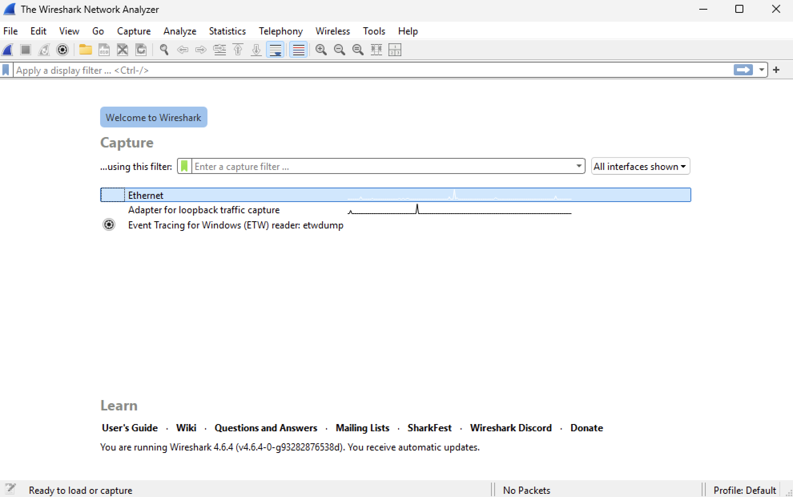
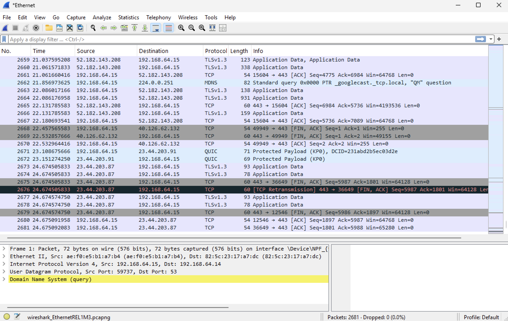
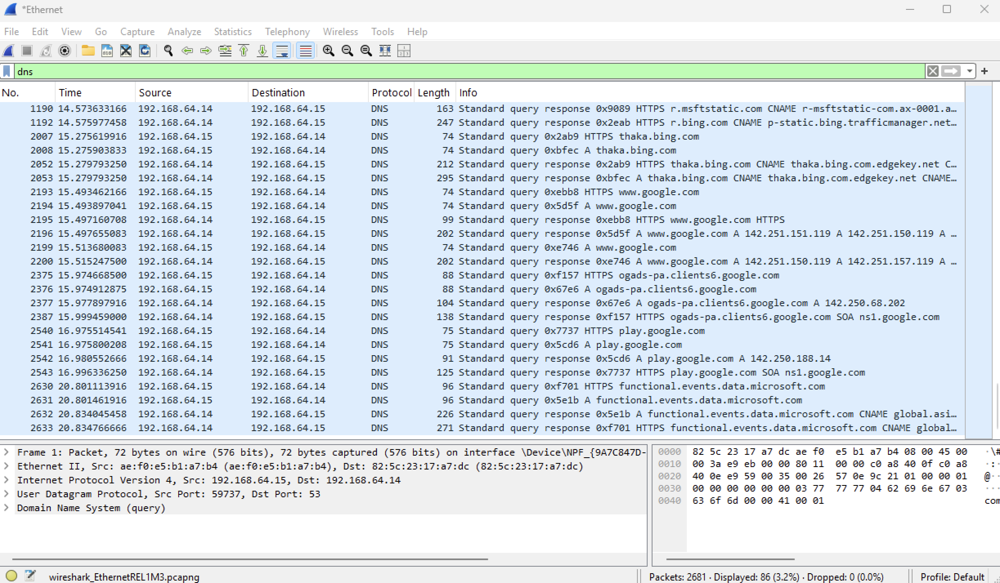
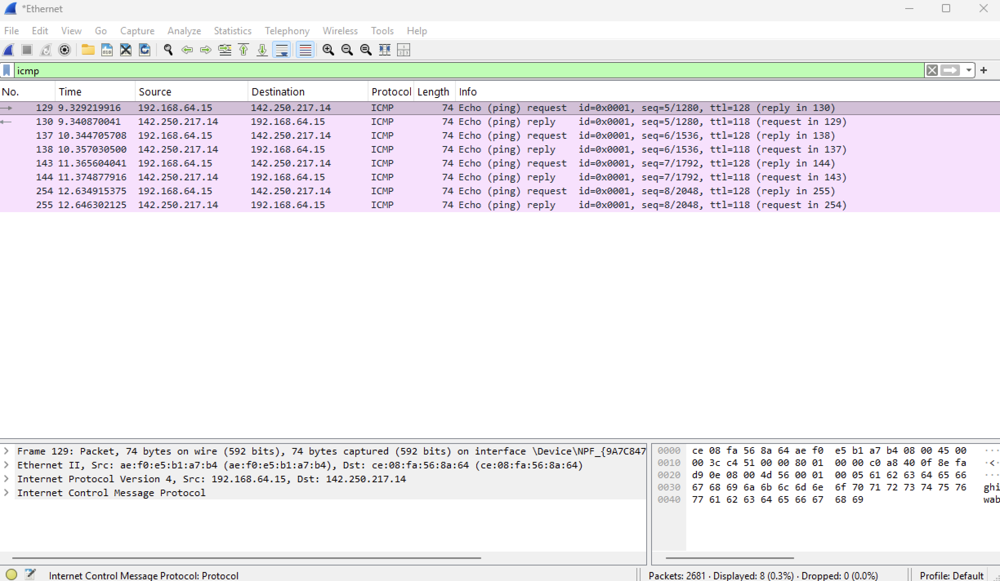
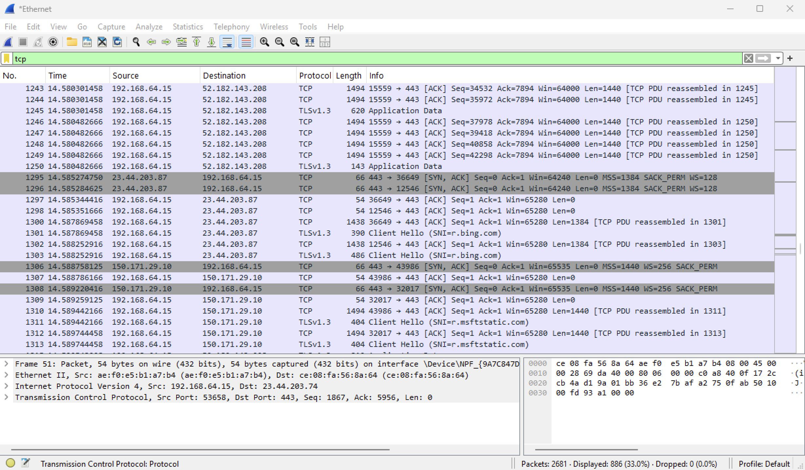
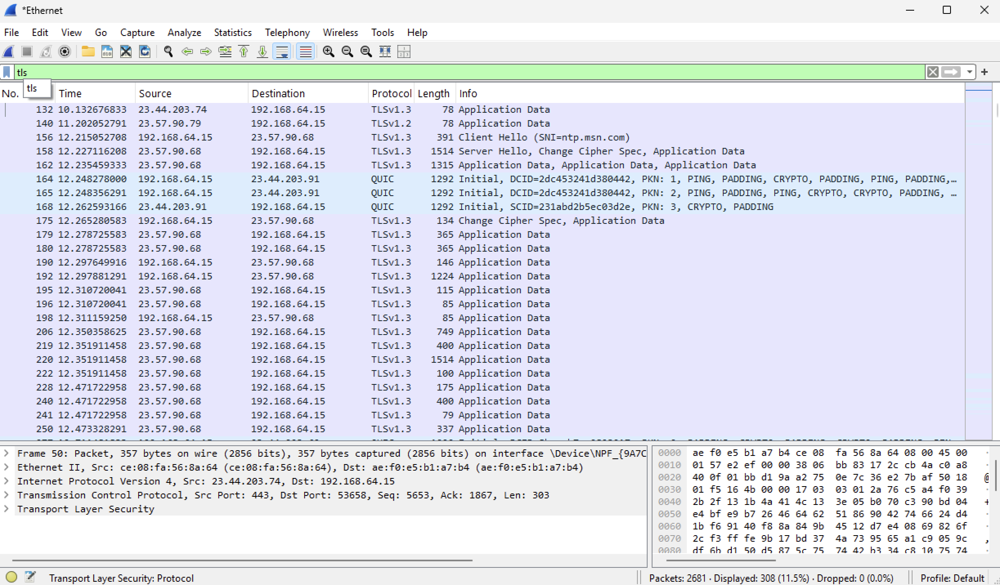
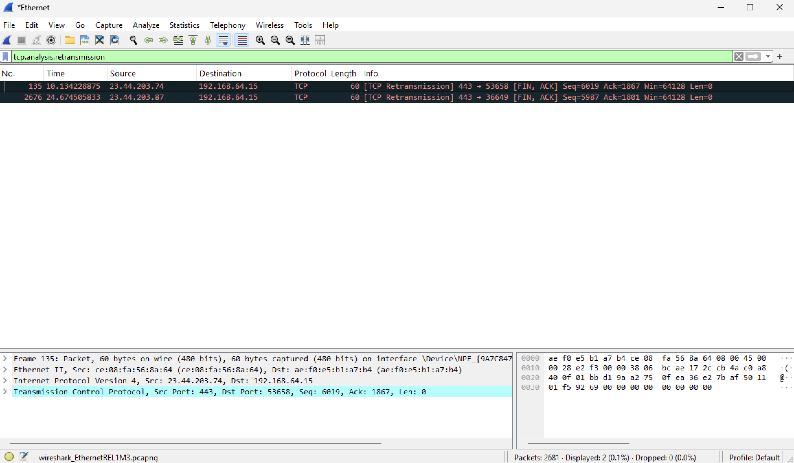

# Wireshark Network Troubleshooting Lab

## Project Overview
This project demonstrates hands-on network analysis using Wireshark in a Windows 11 Pro virtual machine. The lab focuses on capturing live network traffic and analyzing key protocols to understand how systems communicate and how to identify potential network performance issues.

---

## Lab Environment
- Windows 11 Pro Virtual Machine (UTM)
- Wireshark Application

---

## Step 1: Launch Wireshark and Select Interface
Opened Wireshark and selected the active Ethernet interface to begin capturing live network traffic.



Description:  
Wireshark launched and active Ethernet interface selected for packet capture.

---

## Step 2: Capture Live Network Traffic
Started packet capture and generated traffic by visiting websites and running ping commands.



Description:  
Live network traffic captured showing communication between local machine and external servers.

---

## Step 3: Analyze DNS Traffic
Applied a DNS filter to observe how domain names are resolved into IP addresses.

**Filter Used:**
```
dns
```



Description:  
DNS queries and responses captured, showing domain name resolution to IP addresses.

---

## Step 4: Analyze ICMP (Ping) Traffic
Filtered ICMP traffic to verify connectivity between the local machine and an external host.

**Filter Used:**
```
icmp
```



Description:  
ICMP echo requests and replies confirming successful network connectivity.

---

## Step 5: Analyze TCP Connections
Filtered TCP traffic to observe connection behavior between the client and remote servers.

**Filter Used:**
```
tcp
```



Description:  
TCP communication showing connection establishment and data transfer between systems.

---

## Step 6: Analyze Secure Traffic (TLS)
Filtered TLS traffic to observe encrypted communication with external servers.

**Filter Used:**
```
tls
```



Description:  
Encrypted HTTPS traffic captured, demonstrating secure communication between client and server.

---

## Step 7: Identify Network Performance Issues
Applied a retransmission filter to identify potential network issues.

**Filter Used:**
```
tcp.analysis.retransmission
```



Description:  
TCP retransmissions detected, indicating minor packet delay or retransmission during communication.

---

## Key Takeaways
- Captured and analyzed live network traffic using Wireshark
- Verified DNS resolution for domain-to-IP translation
- Confirmed network connectivity using ICMP (ping)
- Observed TCP connection establishment and communication flow
- Identified encrypted HTTPS traffic using TLS
- Detected minor retransmissions as part of network troubleshooting
